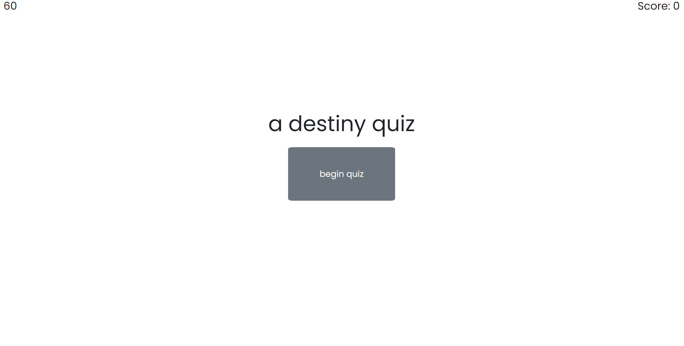

# Challenge 4

# Destiny 2 Quiz by Mason Morris

The objective of this assignment was to create a timed quiz with a leaderboard that saves to the user's localstorage. To accomplish this I used vanilla JavaScript, Jquery, and a little bit of Bootstrap.

[CLick here to view the deployed page!](https://masontmorris.github.io/quiz-challenge-4/)
